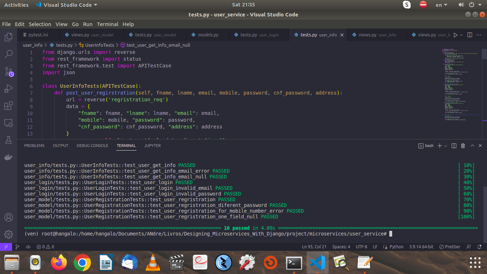

# Designing Microservices Using Django

## Structuring, Deploying and Managing the Microservices Architecture with Django

<h1>
This repo is about my learnin about "Designing Microservices Using Django", book writed by Shayank Jain.
</h1>

<!--

The primary goal of the book is to provide the information and skills that are
necessary to deploy the microservice architecture with Django. The book contains
real-life examples that  show  how to install, configure, and manage the
Django application, as well as how to integrate it into other third-party solutions for
deployment.

-->
# AUTOMATE TEST FOR OUR MICROSERVICE

    

